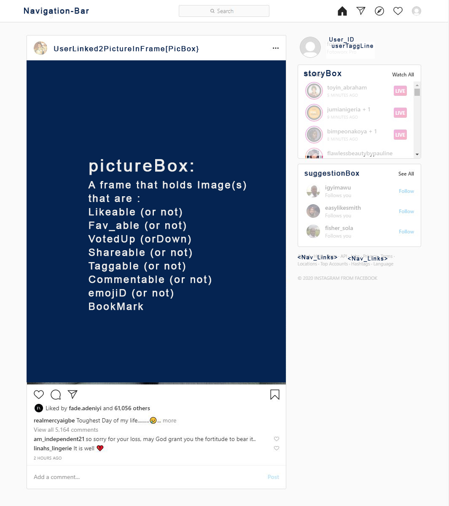
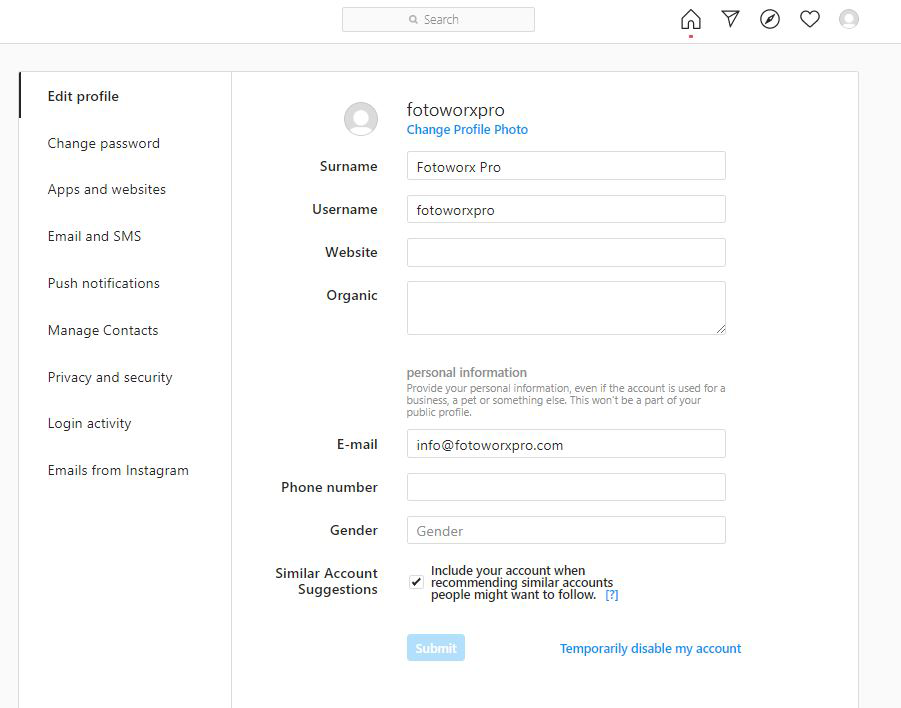
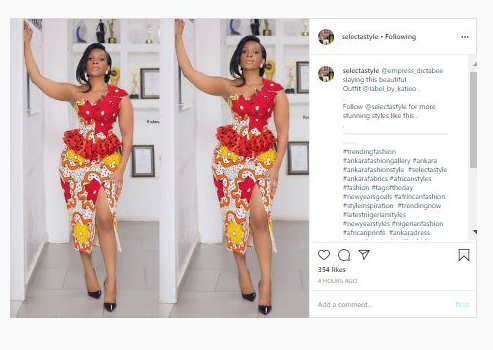
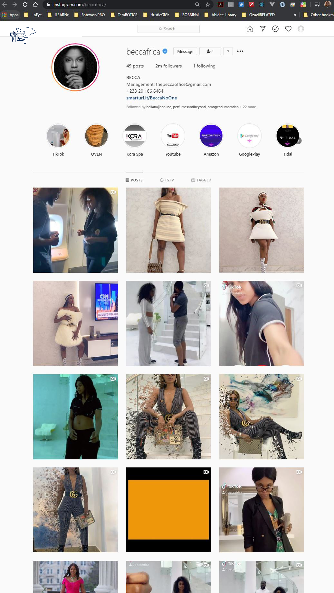
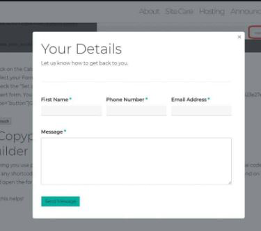
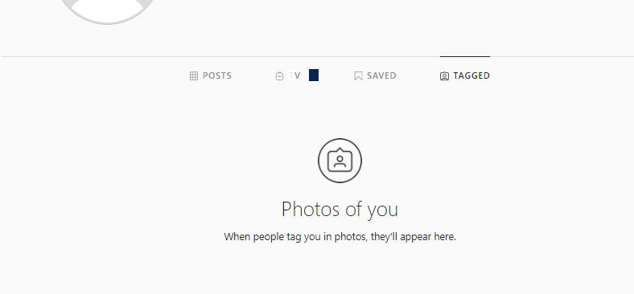

# ReactPhotoApp
MidModProject2

## Objective;
To create a cascadingStyle single-paged photo-sharing-appp with the following functional elements:
1. User Authentication (& Deletion) of User Priofiles & Bios.   Loggin/Signup | Create/Update/Nuke Profile.
2. Photo with "CRUD" [Create, Read, Update, Detele]
3. NavBar & NavLinks
4. Toggle_Reactions: {Like} {Heart} {Fav} {Tag} {Comment} {Vote} {Hide} {Classify[Group?Location?Album?Descriptor<Friends><Work><Travel><Family>] 
5. Analytics: User_Activity  |  Like_Counter   |   Recents:{Updates}{Comments}{Votes}....
6. Search: Users |  Photos | Tags/Classifications  |  Seed* 

## Wireframe
##### This shows both the overall look as well as some of the individual components

## Synopsis
###### Picsure-app: Is a photo sharing app for professional photographers that leverages networks effects for optimizing peer review of professional image/photo portfolio.  Beyond creative proffessionals; It is open to oberervers/clients/fans for viewing showCases but only REGISTERED {creative professionals} can review/critic submitted works.

## SCHEDULED (OBJECTIVES & GOALS)
Mon April 20th:
1. Wireframe        										√ Done
2. NavBAR                           						√ Done
3. User Authentication 					        			√ Done
4. Create Pseudo Code 				        				√ Done
5. Research on How to "CRUD" Reactions   {like, et al}    	√ Done
 
Tue April 21st:
1. Create CSSpages & Syle a little  		    			* WorkInProgress(WIP)
2. Design PictureBox, CommentBox, StatusBox & Reaction_Icons
3. Consider Soicial Media Handles & Sharing to External Pages/Platforms
4. Review Components & DOM-Elements
 

Wed April 22nd:
1. NODEjs all day
2. Consider BootStrap 

 
Thur April 23rd:
1. Scripting & testing  for Responsiveness & WCAG Compatibility
2. Review & Test for bugs.
3. Launch ReactBUILD  (Consider connecting the Photsure GitHub Repo to Netlify...)
